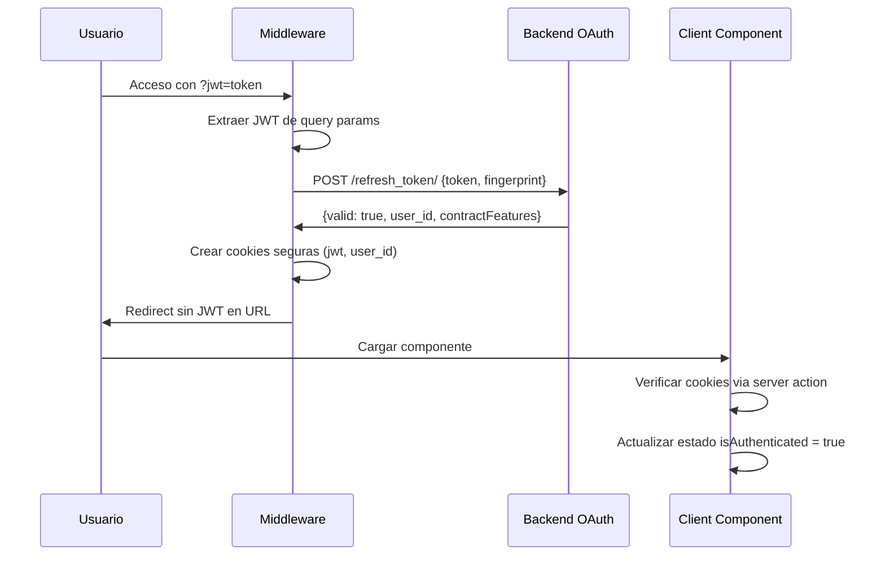
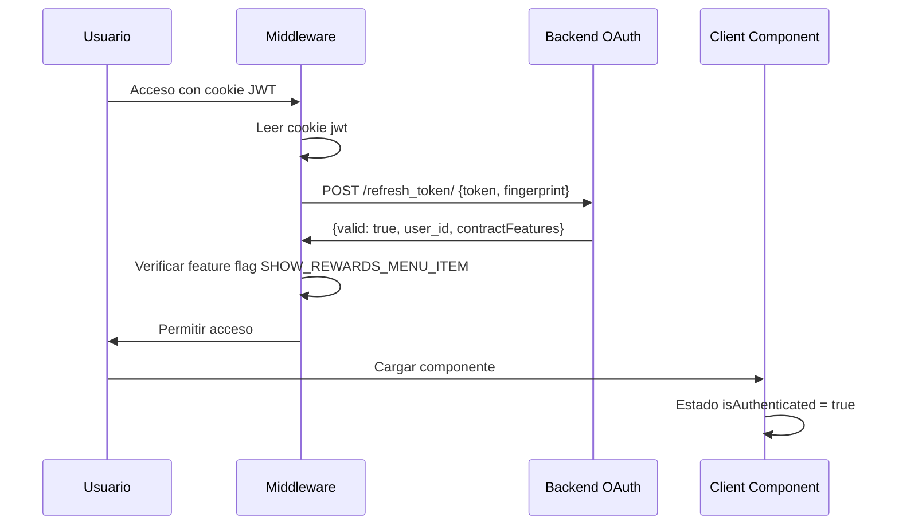
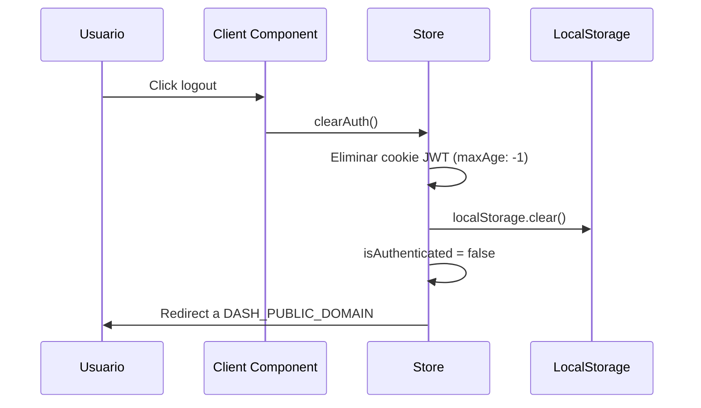

# 6440 · dashboard-santi · Plan

## Objetivo
Implementar una estrategia completa de autenticación JWT con doble validación (server-side middleware + client-side components) para el dashboard de IAD Contact Center, incluyendo gestión segura de cookies, validación externa de tokens, y manejo robusto de errores de autenticación.

## Checklist técnico
- [x] Middleware de autenticación para interceptar todas las peticiones
- [x] Sistema de validación externa contra backend OAuth (/refresh_token/)
- [x] Gestión segura de cookies con configuración de seguridad
- [x] Componente de autenticación client-side con estado reactivo
- [x] Sistema de logout con limpieza completa de sesión
- [x] Manejo diferenciado de errores de autenticación
- [x] Variables de entorno para configuración segura
- [x] Página de error con tipos específicos de mensaje
- [x] Integración con arquitectura Zustand existente
- [ ] Tests para flujos de autenticación críticos
- [ ] Documentación de flujos de seguridad

## Modelo de datos

### Interfaces TypeScript
```typescript
interface AuthState {
  isAuthenticated: boolean;
  user_id: string | null;
  jwt: string | null;
  loading: boolean;
  error: AuthError | null;
}

interface AuthError {
  type: 'DEFAULT' | 'CONTRACT_FEATURES';
  message: string;
}

interface TokenValidationResponse {
  valid: boolean;
  user_id: string;
  contractFeatures: string[];
  error?: string;
}

interface CookieConfig {
  secure: boolean;
  sameSite: 'lax' | 'strict' | 'none';
  domain: string;
  path: string;
  httpOnly?: boolean;
  maxAge: number;
}
```

### Variables de Entorno
```
DASH_PUBLIC_DOMAIN=https://dashboard.iadmexico.mx
OAUTH_BACKEND_URL=https://api.iadmexico.mx
```

## Endpoints

| Method | Route | Purpose | Request | Response | Errores |
|--------|-------|---------|---------|----------|---------|
| POST | `/refresh_token/` | Validar JWT contra OAuth backend | `{token: string, fingerprint: null}` | `{valid: boolean, user_id: string, contractFeatures: string[]}` | 401, 403, 500 |
| GET | `/api/auth/verify` | Verificar cookie JWT (server action) | Headers con cookie | `{authenticated: boolean}` | 401 |
| POST | `/api/auth/logout` | Limpiar sesión completa | - | `{success: boolean}` | 500 |

## Flujos

### Flujo de Autenticación Inicial


### Flujo de Validación de Sesión Existente


### Flujo de Logout


## Implementación por Capas

### 1. Middleware de Autenticación (`middleware.ts`)
```typescript
// Interceptar todas las peticiones
// Excluir rutas estáticas y /error
// Validar JWT desde query params o cookies
// Crear/validar cookies seguras
// Redirigir a /error si falla validación
```

### 2. Store de Autenticación (`stores/useAuthStore.ts`)
```typescript
// Estado: isAuthenticated, user_id, jwt, loading, error
// Acciones: login(), logout(), verifyAuth(), clearAuth()
// Integración con useCallStore existente
```

### 3. Componentes de Autenticación
```typescript
// AuthProvider: Context para estado global
// AuthGuard: HOC para proteger rutas
// LoginHandler: Manejo de JWT en query params
```

### 4. Servicios de API (`services/auth.ts`)
```typescript
// validateToken(): Llamada a /refresh_token/
// verifySession(): Server action para cookies
// logout(): Limpieza de sesión
```

### 5. Página de Error (`pages/error.tsx`)
```typescript
// Manejo de tipos de error: DEFAULT, CONTRACT_FEATURES
// Mensajes específicos según tipo
// Prevención de bucles de redirección
```

## Consideraciones

### Riesgos:
- **Bucles de redirección**: Asegurar que /error esté excluida del middleware
- **Exposición de JWT**: Limpiar query params después de procesar
- **Sesiones huérfanas**: Implementar limpieza automática en logout
- **CORS**: Configurar headers apropiados para llamadas a OAuth backend

### Deuda técnica:
- Implementar refresh automático de tokens antes de expiración
- Añadir rate limiting para intentos de autenticación
- Implementar fingerprinting real (actualmente null)
- Migrar a server-side sessions para mayor seguridad

### Observaciones:
- La implementación debe ser compatible con la arquitectura Zustand existente
- Mantener separación clara entre autenticación y autorización
- Considerar implementación gradual: middleware → store → componentes
- Priorizar testing de flujos críticos (login, logout, validación)

### Integración con Arquitectura Existente:
- **useCallStore**: Añadir verificación de auth antes de API calls
- **Layout.tsx**: Integrar AuthProvider y estado de autenticación
- **services/api.ts**: Incluir JWT automáticamente en headers
- **Componentes existentes**: Proteger con AuthGuard según necesidad
