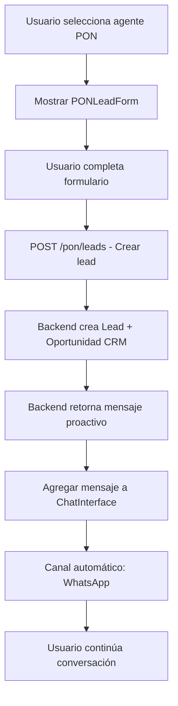

# Plan Técnico: Public Playground para Emulación de Agentes

## Objetivo
Crear un módulo de **Playground Público** separado del sistema de autenticación JWT actual, con acceso mediante contraseña simple, que permita probar agentes con metadatos específicos por canal y funcionalidad especial para agentes PON (reclutamiento de asesores inmobiliarios).

---

## 1. Análisis del Estado Actual

### Componentes a Reutilizar
| Componente | Ubicación | Reutilización |
|------------|-----------|---------------|
| `AgentTesting.tsx` | `@/src/components/agents/tabs/AgentTesting.tsx:1-673` | Lógica de chat, formateo markdown, detalles de respuesta |
| `useAgentStore.ts` | `@/src/stores/useAgentStore.ts` | `sendMessage()`, `fetchAgents()` |
| `agentApi.ts` | `@/src/services/agentApi.ts` | Cliente HTTP, endpoints de agentes |
| `env.ts` | `@/src/env.ts` | Patrón de variables de entorno con fallback |

### Sistema de Autenticación Actual
- JWT validado contra backend OAuth en `AuthMiddleware.tsx`
- Rutas excluidas: `/error`, assets estáticos
- **Agregar**: `/playground` como ruta pública

---

## 2. Arquitectura Propuesta

### 2.1 Estructura de Carpetas (Mínima)
```
src/
├── components/
│   └── public-playground/
│       ├── PublicPlayground.tsx          # Componente principal
│       ├── PlaygroundAuth.tsx            # Autenticación simple
│       ├── ChannelMetadataPanel.tsx      # Selector canal + metadatos
│       ├── PONLeadForm.tsx               # Formulario para asesores
│       └── index.ts
│
├── types/
│   └── playground.ts                     # Tipos específicos
│
└── env.ts                                # Agregar variables playground
```

### 2.2 Componentes Reutilizados de `AgentTesting.tsx`
- `MarkdownMessage` - Formateo de mensajes
- `ChatSession` interface - Estructura de sesión
- `ChatMessage` interface - Estructura de mensajes
- Lógica de `scrollToBottom`, `handleKeyPress`
- Panel de detalles de respuesta (prioridad, razonamiento, etc.)

---

## 3. Especificaciones Técnicas

### 3.1 Variables de Entorno (`src/env.ts`)
```typescript
// Agregar al tipo Env
PLAYGROUND_PASSWORD?: string
PLAYGROUND_ENABLED?: string

// Agregar a env con valores por defecto
PLAYGROUND_PASSWORD:
  rt.PLAYGROUND_PASSWORD ?? import.meta.env.VITE_PLAYGROUND_PASSWORD ?? 'playground2024',
PLAYGROUND_ENABLED:
  rt.PLAYGROUND_ENABLED ?? import.meta.env.VITE_PLAYGROUND_ENABLED ?? 'true',
```

### 3.2 Tipos TypeScript (`src/types/playground.ts`)
```typescript
export type PlaygroundChannel = 'webchat' | 'whatsapp';

// Metadatos por canal
export interface WebchatMetadata {
  property_id?: string;
  intent?: 'schedule_call' | 'schedule_visit';
  channel: 'webchat';
}

export interface WhatsappMetadata {
  phone: string; // Con prefijo de país (+52, +1, etc.)
  channel: 'whatsapp';
}

export interface CustomMetadata {
  key: string;
  value: string;
}

// Datos del Lead PON (Asesores Inmobiliarios)
export type ExperienciaBR = 
  | 'ninguna' 
  | 'menos_1_año' 
  | 'mas_1_año' 
  | 'franquicias_inmobiliarias';

export type ProyectoVida = 
  | 'mas_tiempo' 
  | 'mas_dinero' 
  | 'legado';

export interface PONLeadFormData {
  nombre: string;
  telefono: string;
  ciudad: string;
  email: string;
  experiencia_br: ExperienciaBR;
  meta_financiera: string;
  proyecto_vida: ProyectoVida;
  evento?: string;
}

// Estado del playground
export interface PlaygroundState {
  isAuthenticated: boolean;
  selectedAgentId: string | null;
  selectedChannel: PlaygroundChannel;
  channelMetadata: WebchatMetadata | WhatsappMetadata;
  customMetadata: CustomMetadata[];
}
```

### 3.3 Metadatos por Canal

| Canal | Campos Requeridos | Campos Opcionales |
|-------|-------------------|-------------------|
| **webchat** | `channel` | `property_id`, `intent` |
| **whatsapp** | `phone`, `channel` | - |
| **Ambos** | - | Custom metadata (key-value) |

**Intent options para webchat:**
- `schedule_call` - Agendar llamada
- `schedule_visit` - Agendar visita

---

## 4. Flujo PON (analyticsType === 'PON')

### 4.1 Contexto de Negocio
Los leads PON son **personas interesadas en ser asesores inmobiliarios**, no clientes buscando propiedades.

### 4.2 Campos del Formulario PON
| Campo | Tipo | Requerido | Opciones |
|-------|------|-----------|----------|
| Nombre | text | ✅ | - |
| Teléfono | tel | ✅ | Con prefijo país |
| Ciudad | text | ✅ | - |
| Correo electrónico | email | ✅ | - |
| Experiencia en BR | select | ✅ | Ninguna, < 1 año, > 1 año, Franquicias |
| Meta financiera | text | ✅ | - |
| Proyecto de vida | select | ✅ | Más tiempo, Más dinero, Legado |
| Evento | text | ❌ | Opcional |

### 4.3 Flujo de Simulación


### 4.4 UI del Formulario PON
```
┌─ Simulación de Lead PON ─────────────────────────────┐
│                                                      │
│  ℹ️ Este agente recluta asesores inmobiliarios       │
│     Simula el flujo: Formulario Meta → WhatsApp      │
│                                                      │
│  ┌─ Datos del Prospecto ───────────────────────────┐ │
│  │  Nombre*:           [________________________]  │ │
│  │  Teléfono*:         [+52] [__________________]  │ │
│  │  Ciudad*:           [________________________]  │ │
│  │  Correo*:           [________________________]  │ │
│  │                                                 │ │
│  │  Experiencia en BR*:                            │ │
│  │  [Seleccionar experiencia ▼]                    │ │
│  │    • Ninguna                                    │ │
│  │    • Menos de 1 año                             │ │
│  │    • Más de 1 año                               │ │
│  │    • Experiencia en franquicias inmobiliarias   │ │
│  │                                                 │ │
│  │  Meta financiera*:  [________________________]  │ │
│  │                                                 │ │
│  │  Proyecto de vida*:                             │ │
│  │  [Seleccionar proyecto ▼]                       │ │
│  │    • Más tiempo                                 │ │
│  │    • Más dinero                                 │ │
│  │    • Legado                                     │ │
│  │                                                 │ │
│  │  Evento (opcional): [________________________]  │ │
│  └─────────────────────────────────────────────────┘ │
│                                                      │
│  [🚀 Crear Lead y Simular Mensaje Proactivo]         │
│                                                      │
└──────────────────────────────────────────────────────┘
```

---

## 5. Modificaciones al Sistema Existente

### 5.1 `env.ts` - Agregar variables con defaults
```typescript
export type Env = {
  // ... existentes
  PLAYGROUND_PASSWORD?: string
  PLAYGROUND_ENABLED?: string
}

export const env: Env = {
  // ... existentes
  PLAYGROUND_PASSWORD:
    rt.PLAYGROUND_PASSWORD ?? import.meta.env.VITE_PLAYGROUND_PASSWORD ?? 'playground2024',
  PLAYGROUND_ENABLED:
    rt.PLAYGROUND_ENABLED ?? import.meta.env.VITE_PLAYGROUND_ENABLED ?? 'true',
}
```

### 5.2 `AuthMiddleware.tsx` - Excluir ruta playground
```typescript
// Agregar después de staticPaths
const publicPaths = ['/playground'];
const isPublicPath = publicPaths.some(path => window.location.pathname.startsWith(path));

if (isPublicPath) {
  setIsInitialized(true);
  setLoading(false);
  return;
}
```

### 5.3 `App.tsx` - Agregar renderizado playground
```typescript
import { PublicPlayground } from './components/public-playground';

// Antes del check de isErrorPage
const isPlaygroundPage = window.location.pathname === '/playground';

if (isPlaygroundPage) {
  return <PublicPlayground />;
}
```

---

## 6. Plan de Implementación por Fases

### Fase 1: Infraestructura Base (1-2 horas)
1. Agregar variables a `env.ts` con valores por defecto
2. Crear tipos en `src/types/playground.ts`
3. Modificar `AuthMiddleware.tsx` para excluir `/playground`
4. Modificar `App.tsx` para renderizar playground

### Fase 2: Autenticación y Layout (1-2 horas)
1. Crear `PlaygroundAuth.tsx` con validación de contraseña
2. Crear `PublicPlayground.tsx` (layout principal)
3. Integrar selector de agentes (reutilizar `useAgentStore.fetchAgents`)

### Fase 3: Canal y Metadatos (2-3 horas)
1. Crear `ChannelMetadataPanel.tsx`
2. Implementar toggle webchat/whatsapp
3. Campos dinámicos por canal
4. Custom metadata key-value

### Fase 4: Chat Interface (2-3 horas)
1. Extraer y reutilizar lógica de `AgentTesting.tsx`
2. Integrar metadatos en context del request
3. Panel de detalles de respuesta

### Fase 5: Funcionalidad PON (2-3 horas)
1. Crear `PONLeadForm.tsx` con campos de asesor
2. Agregar endpoint en `agentApi.ts` o crear `playgroundApi.ts`
3. Flujo: formulario → mensaje proactivo → chat con metadata whatsapp

### Fase 6: Polish (1-2 horas)
1. Validaciones de formularios
2. Manejo de errores
3. UI responsive
4. Testing manual

---

## 7. Dependencias de Backend

| Endpoint | Método | Descripción | Estado |
|----------|--------|-------------|--------|
| `/agents` | GET | Listar agentes activos | ✅ Existente |
| `/conversation` | POST | Enviar mensaje con context | ✅ Existente |
| `/pon/leads` | POST | Crear lead PON | ⚠️ A confirmar |

### Request esperado para PON Lead:
```typescript
interface PONLeadRequest {
  formData: PONLeadFormData;
  agentId: string;
  sessionId: string;
}

interface PONLeadResponse {
  leadId: string;
  opportunityId?: string;
  proactiveMessage: string;
  phone: string; // Para metadata whatsapp
}
```

---

## 8. Criterios de Aceptación

- [ ] Ruta `/playground` accesible sin JWT
- [ ] Contraseña por defecto funciona si no hay env configurada
- [ ] Selector de agentes muestra solo agentes activos
- [ ] Cambio de canal actualiza campos de metadata dinámicamente
- [ ] Webchat: property_id e intent opcionales
- [ ] WhatsApp: phone requerido con prefijo país
- [ ] Custom metadata key-value funcional
- [ ] Agentes PON muestran formulario de asesor
- [ ] Formulario PON con todos los campos especificados
- [ ] Flujo PON: formulario → mensaje proactivo → chat whatsapp
- [ ] Reutilización máxima de componentes existentes
- [ ] Detalles de respuesta visibles (prioridad, razonamiento)
