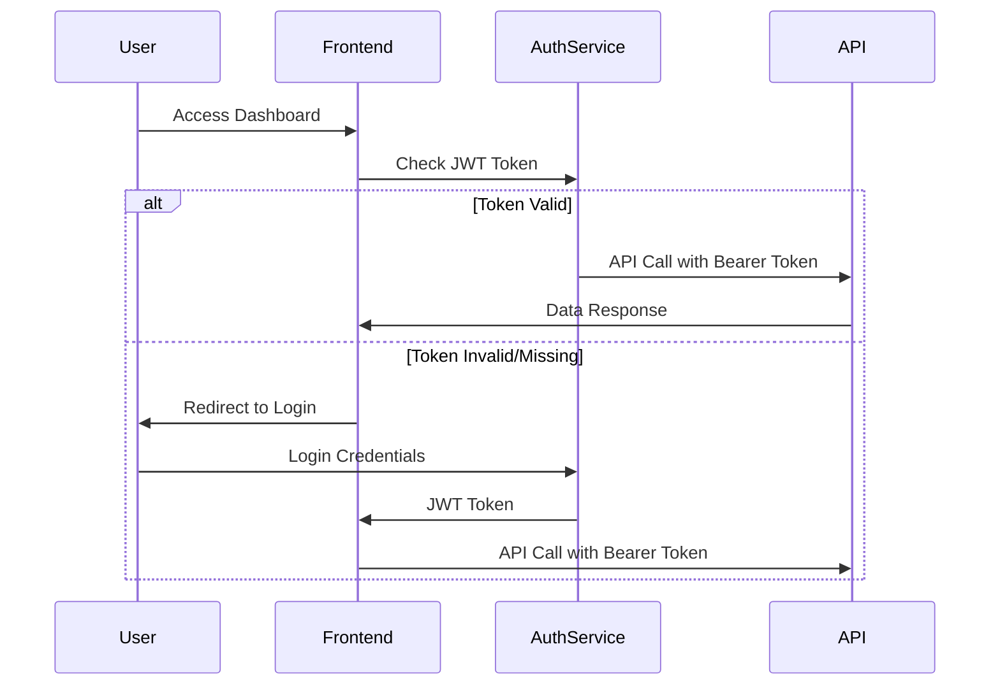

# Architecture Overview – IAD Contact Center Frontend

This project follows a **Component-Based Architecture** with **Feature Modules** and **Centralized State Management**, designed for scalability and maintainability in React applications for managing multi-channel interactions (WhatsApp and Phone calls).

## Key Architectural Principles

- **Feature-based organization** with dedicated modules for each business domain
- **Centralized state management** using Zustand for predictable data flow
- **Component composition** with reusable UI components
- **Type-safe development** with comprehensive TypeScript interfaces
- **API-first approach** with dedicated service layer for external communication
- **Multi-channel support** for WhatsApp and Phone call interactions

---

## 1. Folder Structure

```
src/
├── components/           # Feature modules organized by business domain
│   ├── dashboard/        # Executive dashboard module
│   │   ├── DashboardExecutive.tsx    # Main dashboard component
│   │   ├── MetricCard.tsx           # Reusable metric display component
│   │   ├── ImpactBlock.tsx          # Global impact visualization
│   │   └── ComparisonTable.tsx      # Economic comparison table
│   │
│   ├── interactions/     # Interaction detail management module (WhatsApp + Calls)
│   │   ├── InteractionsDetail.tsx   # Main interactions listing component
│   │   ├── InteractionsTable.tsx    # Paginated table with channel filters
│   │   └── InteractionDetailModal.tsx # Individual interaction detail modal
│   │
│   ├── conversion/       # Conversion analysis module
│   │   ├── ConversionAnalysis.tsx   # Main conversion analysis component
│   │   ├── ConversionFunnel.tsx     # Visual funnel representation
│   │   ├── ConversionFilters.tsx    # Advanced filtering system
│   │   └── ConversionComparison.tsx # SELL vs RENT comparison
│   │
│   ├── search/           # Search lead analysis module
│   │   ├── SearchAnalysis.tsx       # Main search analysis component
│   │   ├── SearchMetrics.tsx        # Search-specific metrics
│   │   ├── SearchFilters.tsx        # Search filtering system
│   │   └── SearchDistribution.tsx   # Geographic and preference distributions
│   │
│   ├── appointments/     # Appointment management module
│   │   ├── AppointmentsModule.tsx   # Main appointments component
│   │   ├── AppointmentCalendar.tsx  # Interactive calendar view
│   │   ├── AppointmentList.tsx      # Appointment listing
│   │   ├── AppointmentMetrics.tsx   # Appointment-specific metrics
│   │   └── AppointmentFilters.tsx   # Appointment filtering system
│   │
│   ├── quality/          # Quality analysis module
│   │   ├── QualityModule.tsx        # Main quality analysis component
│   │   ├── QualityMetrics.tsx       # Quality KPIs and metrics
│   │   ├── CSATDistribution.tsx     # CSAT satisfaction analysis
│   │   ├── ComplaintAnalysis.tsx    # Complaint tracking and analysis
│   │   ├── HumanEscalation.tsx      # Human escalation analysis
│   │   └── QualityFilters.tsx       # Quality filtering system
│   │
│   └── Layout.tsx        # Main application layout with navigation
│
├── stores/               # Centralized state management
│   └── useInteractionStore.ts # Main Zustand store for interaction data and app state
│
├── services/             # External API communication layer
│   └── api.ts            # API client with authentication and endpoints
│
├── types/                # TypeScript type definitions
│   └── index.ts          # Core interfaces (CallRecord, DashboardMetrics, etc.)
│
├── data/                 # Data utilities and mock data
│   └── mockData.ts       # Mock data generation with multi-channel support
│
├── utils/                # Utility functions and helpers
│   └── (future utilities)
│
├── App.tsx               # Main application component with routing logic
├── main.tsx              # Application entry point
└── index.css             # Global styles with Tailwind CSS
```

### Quick Conventions

| Folder | Pattern | Purpose |
|--------|---------|---------|
| `components/` | Feature Modules | Business domain components with complete functionality |
| `stores/` | Zustand Stores | Centralized state management with computed properties for multi-channel data |
| `services/` | API Client Pattern | HTTP communication layer with authentication |
| `types/` | TypeScript Interfaces | Type definitions shared across the application |

**Rule:** Components import types and use stores; API calls are handled through the service layer.

---

## 2. Technology Stack

- **React 18** + **TypeScript** → Component-based UI with type safety
- **Tailwind CSS** → Utility-first styling with responsive design
- **Zustand** → Lightweight state management with computed properties
- **Lucide React** → Consistent icon system
- **date-fns** → Date manipulation and formatting
- **Axios** → HTTP client for API communication
- **Vite** → Fast development and build tooling

---

## 3. Data Flow Architecture

```mermaid
flowchart TD
    API[Interaction Analytics API] -->|JWT Auth| Service[API Service Layer]
    Service -->|InteractionRecord[]| Store[Zustand Store]
    Store -->|Computed Metrics| Components[React Components]
    Components -->|User Actions| Store
    Store -->|API Calls| Service
    
    subgraph "Frontend Layers"
        Components
        Store
        Service
    end
    
    subgraph "External"
        API
    end
```

**Flow Description:**
1. **API Service** handles authentication and HTTP communication
2. **Zustand Store** manages application state and computed metrics for multi-channel interactions
3. **React Components** consume store data and trigger actions
4. **User interactions** flow back through store to API calls

---

## 4. Module Organization

### Dashboard Module (`components/dashboard/`)
- **Purpose:** Executive-level KPIs and global metrics
- **Key Components:** `DashboardExecutive`, `MetricCard`, `ImpactBlock`
- **Data Sources:** `/call-analytics/metrics`, `/call-analytics/global-impact`
- **Multi-channel:** Aggregates metrics across WhatsApp and Phone interactions

### Interactions Module (`components/interactions/`)
- **Purpose:** Individual interaction record exploration and filtering (WhatsApp + Phone)
- **Key Components:** `InteractionsDetail`, `InteractionsTable`, `InteractionDetailModal`
- **Data Sources:** `/call-analytics/calls` with pagination and filters
- **Multi-channel:** Channel-specific filtering and visualization

### Conversion Module (`components/conversion/`)
- **Purpose:** PROPERTY_LEAD conversion funnel analysis
- **Key Components:** `ConversionAnalysis`, `ConversionFunnel`, `ConversionComparison`
- **Data Sources:** Filtered `/call-analytics/calls` (lead_type=PROPERTY_LEAD)

### Search Module (`components/search/`)
- **Purpose:** SEARCH_LEAD geographic and preference analysis
- **Key Components:** `SearchAnalysis`, `SearchMetrics`, `SearchDistribution`
- **Data Sources:** Filtered `/call-analytics/calls` (lead_type=SEARCH_LEAD)

### Appointments Module (`components/appointments/`)
- **Purpose:** Scheduled appointment tracking and calendar view
- **Key Components:** `AppointmentsModule`, `AppointmentCalendar`, `AppointmentList`
- **Data Sources:** Filtered `/call-analytics/calls` (appointment.type != NOT_SCHEDULED)

### Quality Module (`components/quality/`)
- **Purpose:** CSAT, complaints, and human escalation analysis
- **Key Components:** `QualityModule`, `CSATDistribution`, `ComplaintAnalysis`
- **Data Sources:** `/call-analytics/calls` with quality-focused filtering

---

## 5. State Management Strategy

### Zustand Store (`stores/useCallStore.ts`)
### Zustand Store (`stores/useInteractionStore.ts`)

```typescript
interface InteractionStore {
  // State
  interactions: InteractionRecord[];
  currentModule: string;
  loading: boolean;
  error: string | null;
  
  // Actions
  setCurrentModule: (module: string) => void;
  fetchInteractions: (params?: InteractionsParams) => Promise<void>;
  fetchMetrics: (params?: MetricsParams) => Promise<DashboardMetrics>;
  fetchGlobalImpact: (params?: ImpactParams) => Promise<GlobalImpact>;
  
  // Computed Properties (Client-side calculations for filtered data)
  getFilteredInteractions: (filters: FilterParams) => InteractionRecord[];
  getDashboardMetrics: () => DashboardMetrics;
  getGlobalImpact: () => GlobalImpact;
}
```

**Store Responsibilities:**
- **API Communication:** Coordinate with service layer for data fetching
- **State Management:** Hold application state and loading states
- **Computed Properties:** Calculate derived metrics from filtered multi-channel data
- **Module Navigation:** Track current active module

---

## 6. API Integration Layer

### Service Layer (`services/api.ts`)

```typescript
class InteractionAnalyticsAPI {
  // Authentication
  setAuthToken(token: string): void;
  
  // Core endpoints
  getInteractions(params?: InteractionsParams): Promise<PaginatedResponse<InteractionRecord>>;
  getMetrics(params?: MetricsParams): Promise<DashboardMetrics>;
  getGlobalImpact(params?: ImpactParams): Promise<GlobalImpact>;
}
```

**Service Responsibilities:**
- **Authentication:** JWT token management and automatic header injection
- **Error Handling:** Standardized error responses and retry logic
- **Request/Response Mapping:** Transform API responses to TypeScript interfaces
- **Caching Strategy:** Optional response caching for performance

---

## 7. Component Architecture Patterns

### Container Components
- **Purpose:** Data fetching, state management, and business logic
- **Examples:** `DashboardExecutive`, `InteractionsDetail`, `ConversionAnalysis`
- **Responsibilities:** API calls, filter management, data transformation

### Presentation Components
- **Purpose:** Pure UI rendering with props-based data
- **Examples:** `MetricCard`, `InteractionsTable`, `ConversionFunnel`
- **Responsibilities:** Display data, handle user interactions, emit events

### Filter Components
- **Purpose:** User input collection and filter state management
- **Examples:** `ConversionFilters`, `SearchFilters`, `QualityFilters`
- **Responsibilities:** Form handling, validation, filter state updates

---

## 8. Type System

### Core Interfaces (`types/index.ts`)

```typescript
// Main data model
interface InteractionRecord {
  phonecall_id: number;
  source: string;
  channel: 'whatsapp' | 'call';  // Multi-channel support
  lead_type: 'PROPERTY_LEAD' | 'SEARCH_LEAD' | 'LOCATION_LEAD';
  operation_type: 'SELL' | 'RENT';
  // ... complete structure
}

// Computed metrics
interface DashboardMetrics {
  totalCalls: number;
  appointmentRate: number;
  // ... complete structure
}

// API response wrappers
interface PaginatedResponse<T> {
  data: T[];
  total: number;
  page: number;
  limit: number;
  totalPages: number;
}
```

---

## 9. Authentication Flow



---

## 10. Performance Considerations

### Client-Side Optimizations
- **React.memo** for expensive components
- **useMemo** for computed values and filtered data
- **Lazy loading** for module components
- **Virtual scrolling** for large data tables

### API Optimizations
- **Server-side pagination** to reduce payload size
- **Server-side filtering** to minimize client processing
- **Response caching** for frequently accessed metrics
- **Debounced search** to reduce API calls

---

## 11. Development Workflow

### New Feature Checklist
1. **Define Types:** Add interfaces to `src/types/index.ts`
2. **Create Service Methods:** Add API calls to `src/services/api.ts`
3. **Update Store:** Add actions and computed properties to `useCallStore`
4. **Build Components:** Create feature module in `src/components/<module>/`
5. **Add Navigation:** Update `Layout.tsx` with new module
6. **Update Routing:** Add module case to `App.tsx`

### Component Development Pattern
1. **Container Component:** Data fetching and business logic
2. **Presentation Components:** Pure UI components
3. **Filter Components:** User input and filter management
4. **Modal/Detail Components:** Detailed views and interactions

---

## 12. API Endpoint Mapping

| Frontend Module | Primary Endpoint | Secondary Endpoints |
|----------------|------------------|-------------------|
| Dashboard | `/call-analytics/metrics` | `/call-analytics/global-impact` |
| Interactions Detail | `/call-analytics/calls` | - |
| Conversion Analysis | `/call-analytics/calls?lead_type=PROPERTY_LEAD` | - |
| Search Analysis | `/call-analytics/calls?lead_type=SEARCH_LEAD` | - |
| Appointments | `/call-analytics/calls` (filtered by appointment) | - |
| Quality | `/call-analytics/calls` (quality-focused filters) | - |
| **Multi-channel filtering** | All endpoints support `channel` parameter | `?channel=whatsapp` or `?channel=call` |

---

## 13. Error Handling Strategy

### API Error Handling
```typescript
// Service layer error handling
try {
  const response = await apiClient.get('/interactions');
  return response.data;
} catch (error) {
  if (error.response?.status === 401) {
    // Handle authentication error
    redirectToLogin();
  } else if (error.response?.status >= 500) {
    // Handle server errors
    showErrorNotification('Server error occurred');
  }
  throw error;
}
```

### Component Error Boundaries
- **Loading States:** Show spinners during API calls
- **Error States:** Display user-friendly error messages
- **Empty States:** Handle cases with no data gracefully
- **Retry Mechanisms:** Allow users to retry failed operations

---

## 14. Responsive Design System

### Breakpoint Strategy
- **Mobile First:** Base styles for mobile devices
- **Progressive Enhancement:** Add complexity for larger screens
- **Grid Systems:** Responsive grid layouts for all modules
- **Component Adaptability:** Components adapt to screen size

### Design Tokens
```css
/* Color System */
--primary-orange: #FFA500;
--secondary-purple: #6952FA;
--success-green: #10B981;
--error-red: #DC2626;
--warning-yellow: #F59E0B;

/* Spacing System (8px base) */
--spacing-1: 0.5rem;  /* 8px */
--spacing-2: 1rem;    /* 16px */
--spacing-3: 1.5rem;  /* 24px */
--spacing-4: 2rem;    /* 32px */
```

---

## 15. Future Scalability Considerations

### Performance Optimizations
- **Code Splitting:** Lazy load modules for faster initial load
- **Virtual Scrolling:** Handle large multi-channel datasets efficiently
- **Memoization:** Cache expensive calculations
- **Bundle Optimization:** Tree shaking and chunk splitting

### Feature Extensibility
- **Plugin Architecture:** Easy addition of new analysis modules
- **Configurable Dashboards:** User-customizable metric displays
- **Export Capabilities:** Data export functionality
- **Real-time Updates:** WebSocket integration for live multi-channel data

### Monitoring and Analytics
- **Error Tracking:** Integration with error monitoring services
- **Performance Monitoring:** Track component render times
- **User Analytics:** Track feature usage and user flows
- **API Monitoring:** Track API response times and error rates

---

## 16. Development Environment

### Required Environment Variables
```env
VITE_API_BASE_URL=https://api.example.com
VITE_AUTH_ENABLED=true
VITE_MOCK_DATA=false
```

### Development Scripts
```json
{
  "dev": "vite",                    // Development server
  "build": "vite build",            // Production build
  "preview": "vite preview",        // Preview production build
  "lint": "eslint .",               // Code linting
  "type-check": "tsc --noEmit"      // Type checking
}
```

---

## 17. Testing Strategy

### Component Testing
- **Unit Tests:** Individual component functionality including channel-specific logic
- **Integration Tests:** Component interaction with stores
- **API Tests:** Service layer and API integration
- **E2E Tests:** Complete user workflows

### Mock Data Strategy
- **Development:** Use `mockData.ts` when API is unavailable
- **Testing:** Consistent test data for reliable tests
- **Staging:** Hybrid approach with real multi-channel API and fallback mocks

---

## 18. Deployment Architecture

### Build Process
1. **Type Checking:** Ensure TypeScript compilation
2. **Linting:** Code quality validation
3. **Asset Optimization:** Image and bundle optimization
4. **Static Generation:** Build static assets for CDN

### Environment Configuration
- **Development:** Local API with mock data fallback
- **Staging:** Staging API with real data
- **Production:** Production API with full authentication and multi-channel support

---

This architecture ensures **maintainability**, **scalability**, and **type safety** while providing a clear separation of concerns between data management, business logic, and presentation layers. The multi-channel support (WhatsApp + Phone calls) is seamlessly integrated throughout all layers of the application.